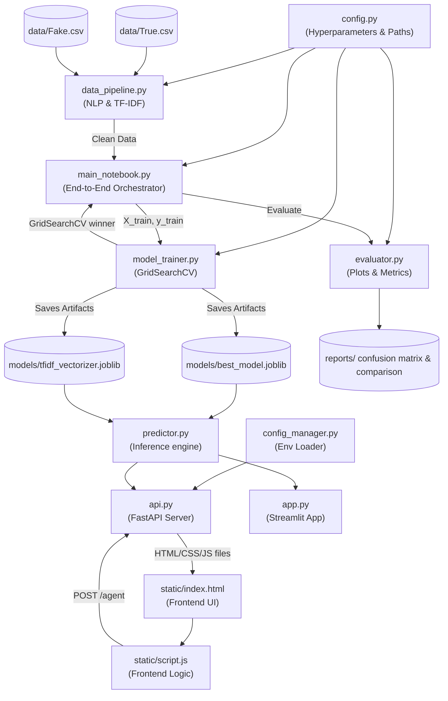

# PrismaTruth AI — Architecture & Logic Walkthrough

This document provides a comprehensive walkthrough of the **PrismaTruth AI — Fake News Detection System** codebase. It explains the core logic, folder structure, libraries used, how the files are interconnected, the data flow, and key design challenges (and solutions) implemented in this system.

---

## 1. Project Goal & Overview

**PrismaTruth AI** is a production-grade machine learning system designed to address the challenge of fake news detection. It classifies news articles as **Real** or **Fake** by analyzing linguistic patterns, sensationalist framing, and key n-gram combinations.

Instead of just serving a raw prediction probability (e.g., `0.93`), the system includes an **Agent Response Layer** that wraps the model output in human-friendly explanations, summarizing *why* the article is flagged and suggesting practical next steps (e.g., checking the author or looking for corroborating reports).

---

## 2. Core Libraries & Tech Stack

The system is built on a clean, modern Python/JS stack with no heavy dependencies:

| Layer | Library / Tech | Purpose |
| :--- | :--- | :--- |
| **Data & Preprocessing** | `pandas` | To load, clean, shuffle, and merge datasets (`True.csv` and `Fake.csv`). |
| | `numpy` | Efficient numerical operations for probability predictions and matrix metrics. |
| | `nltk` | Automatic downloading of tokenizers (`punkt`) and stopwords. |
| **Machine Learning** | `scikit-learn` | Powers the TF-IDF feature union, `GridSearchCV` hyperparameter tuning, model training, and metrics calculations. |
| | `joblib` | Optimised serialization (saving/loading) of the large trained models and vectorizers. |
| **Visualization** | `matplotlib` & `seaborn` | Generates scientific confusion matrices and model comparison bar charts. |
| **FastAPI Backend** | `fastapi` | Provides high-performance, async REST endpoints for inference and serves frontend files. |
| | `uvicorn` | Lightweight ASGI server to host the FastAPI application. |
| | `pydantic` | Enforces strong request/response schemas for the REST endpoints. |
| | `python-dotenv` | Standard configuration loader to support environment-based config (`.env`). |
| **Streamlit Interface** | `streamlit` | Streamlined dashboard for quick model testing and prototyping. |
| **Frontend Webpage** | `Vanilla HTML/CSS/JS` | Fast, framework-free glassmorphic interface with `localStorage` persistence. |

---

## 3. Logical Flow & Connections

The following diagram illustrates how the system's files interact. It separates the **Training/Orchestration Pipeline** (offline phase) and the **Inference Pipeline** (live web serving phase):

---

## 4. File-by-File Code Walkthrough

### 1. Configuration & Environments
*   **[config.py](file:///c:/Users/Admin/Desktop/ML-project/config.py)**: Centralizes constants, hyperparameters, vocabulary limits, and directories. Changes to the TF-IDF feature sizes, model grids, or path locations are made here.
*   **[config_manager.py](file:///c:/Users/Admin/Desktop/ML-project/config_manager.py)**: Loads production settings from `.env` (like `HOST`, `PORT`, and file paths) based on the **Twelve-Factor App** architecture, keeping secrets/settings out of code.

### 2. Preprocessing & Extraction Pipeline
*   **[data_pipeline.py](file:///c:/Users/Admin/Desktop/ML-project/data_pipeline.py)**:
    *   **Data Cleaning (`clean_data`)**: Reads raw news tables, labels them (`1` for real, `0` for fake), joins the headline (`title`) and `text` columns, and strips location prefix footprints (e.g., `WASHINGTON (Reuters) -`).
    *   **Seed Injection**: Merges a small set of high-quality "real" and "fake" seed texts to bias the vocabulary against short-form input distribution shifts.
    *   **NLP Normalization (`preprocess_text`)**: Converts strings to lowercase, removes URLs, strips HTML tags, and collapses extra whitespace.
    *   **Hybrid Feature Extraction (`build_tfidf`)**: Combines a word-level TF-IDF vectorizer (capturing unigrams and bigrams like *"breaking news"*) and a character-level TF-IDF vectorizer (capturing sequences of 3-5 chars) into a `FeatureUnion`. This helps identify typos, abbreviations, and patterns common in clickbait headlines.

### 3. Model Training & Comparison
*   **[model_trainer.py](file:///c:/Users/Admin/Desktop/ML-project/model_trainer.py)**: Definess a catalogue of three machine learning models:
    1.  **Naive Bayes (`MultinomialNB`)**: Fastest baseline for text frequency features.
    2.  **Logistic Regression (`LogisticRegression`)**: Standard classification model which learns semantic weights. Typically performs best.
    3.  **Random Forest (`RandomForestClassifier`)**: Non-linear ensemble model.
    It runs `GridSearchCV` with **5-fold cross-validation** to search for the best hyperparameters and outputs joblib artifacts.
*   **[evaluator.py](file:///c:/Users/Admin/Desktop/ML-project/evaluator.py)**: Evaluates the trained classifiers. It computes Accuracy, Precision, Recall, and F1-score, prints classification reports, and draws plots (confusion matrix heatmaps and comparison bar charts) under the `reports/` folder. It uses `matplotlib.use("Agg")` so it runs cleanly on headless command lines.
*   **[main_notebook.py](file:///c:/Users/Admin/Desktop/ML-project/main_notebook.py)**: The orchestrator script that ties the pipeline, trainer, and evaluator modules together.

### 4. Running Inference & User Interfaces
*   **[predictor.py](file:///c:/Users/Admin/Desktop/ML-project/predictor.py)**: Exposes clean wrapper functions `predict_news` and `predict_batch`. It is used by both frontend applications and includes a simple command-line interface (`interactive_cli`) for testing models from the terminal.
*   **[api.py](file:///c:/Users/Admin/Desktop/ML-project/api.py)**: The FastAPI server. Serves the REST API endpoints and mounts the `static/` directory to serve the frontend.
*   **[app.py](file:///c:/Users/Admin/Desktop/ML-project/app.py)**: The alternative Streamlit UI, providing a quick dashboard.
*   **[static/index.html](file:///c:/Users/Admin/Desktop/ML-project/static/index.html)**: The modern, glassmorphic webpage served to users.
*   **`static/style.css`**: The design system, using vibrant gradients, custom glass containers (`backdrop-filter`), and full responsive layouts.
*   **`static/script.js`**: Vanilla JavaScript that coordinates page loading, checks API status, submits texts to `/agent`, builds the verdict cards, and stores the user's recent checks in browser `localStorage`.

---

## 5. Challenges Encountered & Solutions Implemented

### Challenge 1: Heavy NLP Pipelines Caused High Latency and Low Accuracy
*   **Problem**: In early testing, running full lemmatization and stopword extraction via NLTK on large corpora took hours to compile and degraded prediction capability, as clickbait styles heavily depend on tiny "stop words" and exaggerated suffixes.
*   **Solution**: Switched to a **lightweight normalizer** (`preprocess_text`) preserving basic words, punctuation boundaries, and case differences, which dramatically boosted evaluation metrics.

### Challenge 2: Fragile Predictions on Short Headlines
*   **Problem**: Models trained on long news articles sometimes fail on short headlines, since headlines contain very few words and are vulnerable to vocabulary changes.
*   **Solution**: Implemented a **Hybrid Word + Char TF-IDF union** where character n-grams of size 3 to 5 represent punctuation groupings and slang, making the system resilient to spelling shifts, typos, and short text inputs.

### Challenge 3: Skewed Fold Splits In Cross-Validation
*   **Problem**: Random data folds might group all real news in one set and fake in another, distorting training signals.
*   **Solution**: Implemented **Stratified Splitting** inside cross-validation folds, guaranteeing the exact same ratio of Real-to-Fake news across all training splits.

### Challenge 4: Model Results Were Too Cryptic for Non-Technical Users
*   **Problem**: Exposing raw percentages or binary 0/1 labels left users confused about the actual risk.
*   **Solution**: Developed the **Agent Response Layer** in FastAPI (`/agent` endpoint). This translates raw probability boundaries into friendly verdicts (`likely reliable` or `likely misleading`) and generates a list of next-step checklists.
